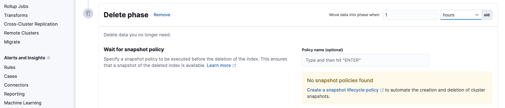
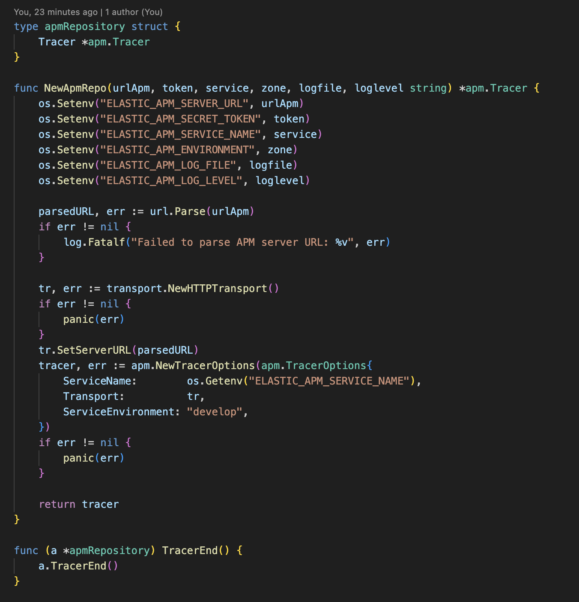

# Deploy elk on docker compose

#### step1: Start Filebeat, Logstash, Elasticsearch, Kibana, FleetServer

docker compose up --build -d

username: elastic

password: changeme

---

#### step2: Configure logstash

##### 2.1 Consume from rabbitmq

**format message**

{NameService:**"NameService"**, Data: **"Data"**, Err: **"Err"**}

---

**revise setting from logstash.conf**

input:

queue => ${**_queueName}_**

addfield => { "queue" => **${queueName}** }

output:

[queue] == **${queueName}**

index => "${**queueName}\_**%{**NameService**}%{+YYYY.MM.DD}"

---

**example on KIbana**

Menu > Stack Management > Index Management > Data > Index Management

##### 2.2 Consume from beat

**format message**

{"level":"**logLevel**","timestamp":"**2024-05-06T03:55:43.944Z**","caller":"**logs/logs.go:46**","msg":"{\"NameService\":\"**NameService**\",\"Data\":" **logMessage**"}

**_PS, See stap to set up apm agent step5_**

---

**revise setting from logstash.conf**

uncomment **beat{...}** to enable receive data from filebeat

---

You can custom field to show on Kibana

mutate {

    add_field => {"**customField**" => "**FieldtoMap**"}

}

---

set if condition to specific containerName before send data to Kibana

output:

    [type] == "**containerName**"

#### step3: Configure on Kibana

##### 3.1 Set data view

Menu > Stack Management > Index Management > Kibana > Data Views > Create data view

Menu > Stack Management > Index Management > Kibana > Data Views > Create data view

##### 3.2 Set retention policy (Delete)

**Create delete policy**

Menu > Stack Management > Index Lifecycle Management > Index Lifecycle Policies > Create policy

**Create index template**

Menu > Management > Dev Tool

**Add policy into index template**

_PS, copy code in set_policy.txt_

**Check linked index with policy**

##### 3.3 Set rule alert

###### 3.3.1 Create connectors

Menu > Stack Management > Rules > Alerts and Insigths > Connectors

###### 3.3.2 Create rule

Menu > Stack Management > Rules > Alerts and Insigths > Rules > Create rule

STACK RULES > Index threshold

Actions > Webhook

#### step4: Configure APM

Menu > Management > Fleet > Setting

Click Edit to import finger print and Certificate

Correct host for elasticsearch

default: http://localhost:9200 >> https://es01:9200

**Advanced YAML configuration**

docker cp es-es01-1:/usr/share/elasticsearch/config/certs/ca/ca.crt ./

ssl:
certificate_authorities:

- |
  ${ca.crt}

**Elasticsearch CA trusted fingerprint (optional)**

cmd : openssl x509 -fingerprint -sha256 -noout -in ./ca.crt | awk -F"=" {' print $2 '} | sed s/://g

Then service which connect to fleet server will appear

Menu > Observability > APM

#### step5: Setup APM agent on golang

set these variable

create adapter for apm repo

Handling http request/response and capture error

#### Uninstall

> docker compose down --remove-orphans --volume
